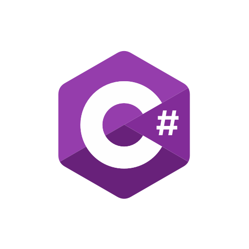
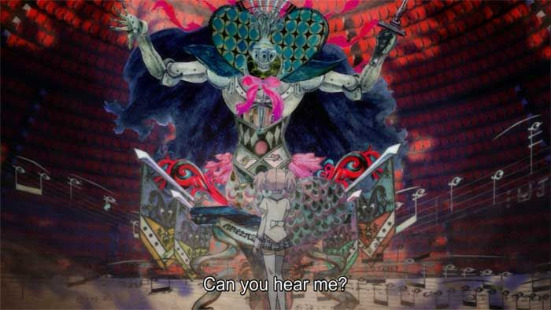

# PROYECTOS REALIZADOS

En el presente archivo Markdown enlistaré los proyectos más importantes que he realizado.

---

## Proyectos escolares

Entre los proyectos escolares que he podido realizar se encuentran los siguientes:

### Bases de datos

- Elaboración de una base de datos para una aplicación de viajes.
- Recuperación de archivos password sobre bases de datos tipo Oracle.

### Programación

- **Simulación de un juego de UNO** 
  Proyecto para la asignatura *Programación Orientada a Objetos*. Juego a nivel terminal. Hecho en **C#**.

- **Calculadora de unidades** 
  Proyecto para la asignatura *Física*. Programa realizado en **C++**.

- **Simulación de un mercado** 
  Proyecto para la asignatura *Programación Orientada a Objetos*. Simulación a nivel terminal. Hecho en **Java**.

- **Dispensador de alimentos para gatos** 
  Proyecto para la asignatura *Sistemas Operativos*. Incluye interfaz gráfica. Hecho en **Python**.

- **Juego Pong** 
  Proyecto para la asignatura *Estructura y Programación de Computadoras*. Hecho en **Ensamblador x86**.

- **Proyectos sobre FPGA** 
  Programados en **VHDL** para las asignaturas *Diseño Digital Moderno* y *Diseño Digital VLSI*.

- **Analizador léxico** 
  Programado en **Hare** (lenguaje basado en Go) para la asignatura *Compiladores*.

- **Programas para estudiar japonés** 
  Programas en **C#** y **Python** para practicar estructuras de datos y vocabulario en idioma japonés.

  

---

## Proyectos musicales

Desde niño he estado en constante conexión con el mundo de la música. Pude cursar cinco semestres en la Facultad de Música de la UNAM y siete años en la Escuela de Iniciación a la Música y la Danza del Centro Cultural Ollin Yoliztli.

### Instrumentista

- **Método de Fernando Carulli** 
  Completé 18 ejercicios.

- **Piezas de gran dificultad** 
  Completé 4 piezas de gran dificultad en guitarra: 
  - [*Capricho Árabe* – Tárrega](https://youtu.be/6uJP3gH8SwY?si=6L3dI59aISI2-SQL) 
  - [*Agua e Vinho* – Gismonti](https://youtu.be/vMRbGQCrQlM?si=oA9ISlFPSWfiDOwf) 
  - [*Tarantella* – Johan Kaspar](https://youtu.be/RjSvY-RvIUY?si=mKlpX4iX_yPJOojW) 
  - [*Los Canarios* – Sanz](https://youtu.be/cp-JTGMMdsI?si=1IY_oQUF3--TwKYu)

- **Piezas en orquesta de guitarras** 
  Toqué varias piezas para orquesta de guitarras, entre ellas: *La Llorona*, *La Bruja*, *Tierra Mestiza*, *Palladio* y piezas infantiles.

### Composición

- **Piezas en modos antiguos** 
  Composiciones en modos frigio, lidio, eólico, entre otros.

- **Piezas mezclando modos** 
  Composición en fa# dórico mezclado con escala pentatónica.

- **Suite Romántica para piano** 
  Cuatro piezas que emplean ritmos del período romántico.

- **Suite Romántica para múltiples instrumentos** 
  Similar a la suite para piano, pero escrita para violonchelo y vibráfono.

- **Suite Barroca para piano** 
  Incluye distintas danzas antiguas.

- **Suite Barroca para múltiples instrumentos** 
  Danzas compuestas para violonchelo y flauta.

- **Transcripción de música de bandas de guerra** 
  *Erikka*, *Säkkijärven Polkka*, *Katyusha*, y otras piezas transcritas para guitarra.

- **Arreglos de música de Madoka Magica** 
  Arreglos de: 
  - [*The Imaginator*](https://youtu.be/6epKRQgt98Q?si=wzP0iqPhx9h9d39_) 
  - [*Decretum*](https://youtu.be/XeMVu1OYYps?si=wQP3HHmnE45iYjDi) 
  - y otras canciones usadas para la banda sonora de *Madoka Magica* 💖

  

---
